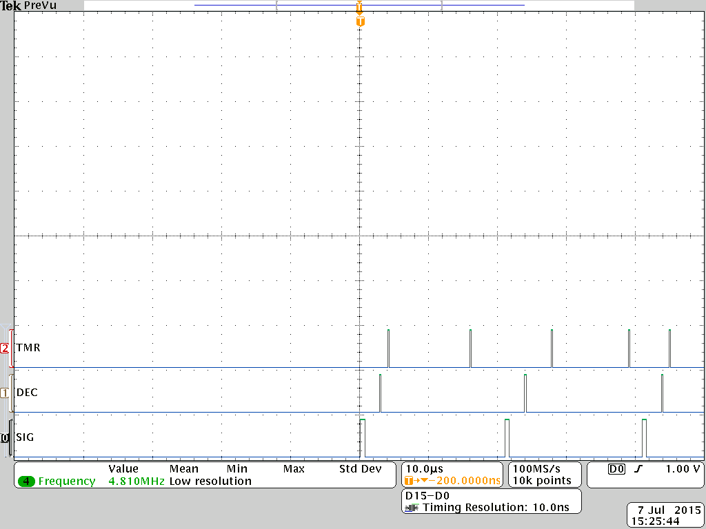

Serial Protocol over the Debugger<->Target Signal Line
======================================================

The debugger and target exchange messages on the *signal* GPIO line in order to
coordinate entering and exiting active debug mode (tethered mode where target
is powered by the debugger). The messages correspond to the transitions on
the state machines that define the handshake for entering and exiting debug
mode:

Most messages that need to be passed between the debugger and the target on
the *signal* GPIO line need to contain only one-bit of information, so
a simple pulse suffices. The pulse duration of one debugger or target
clock cycle is sufficient to be latched by either recepient (the
minimum duration for latch is about 20ns, iirc).

However, to support multiple variants of debug mode, such as with/without UART,
interractive or non-interactive (latter useful for energy guards), one of the
messages needs to defines the functionality in the debug mode. This requires
transmitting a bitmask several bits long. This data is serially encoded onto
the GPIO line as described below. This message is one way from the target to
the debugger.

The message consists of a sequence of pulses: the start pulse, the pulses (or
gaps) that encode the data bits, and a terminating pulse.  Data bits are
encoded as pulse/no-pulse separate by a fixed interval. Macros define the
intervals in cycles for both the encoder (target) and the decoder (debugger),
which have different clock rates. The decoding is initiated when the start
pulse triggers an interrupt. To keep track of the bit index that is currently
being communicated, a timer is started with period equal to the bit interval
and a rollover action that decrements the bit index. Meanwhile, each pulse
triggers an ISR and a bit is shifted into the decoded data value at the current bit
index. When the number of bit intervals equal to the payload length elapses,
the decoder waits for the terminator pulse and once triggered, stops the timer,
which completes the decoding process.

The following trace shows the encoding and decoding process in action for a
data payload of length 3 bits and value 0x2, i.e 0b010. The SIG line is the
actual communication line, the TMR and DEC lines are exposed for diagnosis
only. The decoder pulses the TMR line whenever it starts a timer, the timer
overflow ISR runs, or it stops the timer. The decoder pulses the DEC line
whenever the ISR that watches for pulses on the SIG line runs. The delay
between a pulse on the SIG line and the following pulse on the DEC line is the
effective interrupt latency on the debugger.

Note that it is possible to unconditionally enable the UART and pass this
information over the UART, however this introduces very heavy *time* overhead
for non-interactive active-debug-mode intervals, such as are used for energy
guards. This cost does not cause energy interference because at the time
of this message, the target is already tethered.

To diagnose the implementation, a USB command USB_CMD_SERIAL_ECHO was added.
This command has the debugger send a given value to the target, which encodes
the value on to the serial line, and lets the debugger decode it and send it
over to the host. A compile-time config switch to expose internal events on the
decoder side (see trace above) is CONFIG_SIG_SERIAL_DECODE_PINS.
